<!-- markdownlint-disable MD013 MD033 MD041 -->

  

<h1 align="center">Ashkan Gholizadeh</h1>

  Full Stack&nbsp; ·&nbsp; Security Specialist&nbsp; ·&nbsp; <a href="https://hiprax.com">Hiprax</a> Team

  
  
  

 

## 👨‍💻 About Me

I'm a full-stack developer focused on backend systems and application security. I spend my time designing database schemas, writing core business logic, and hardening APIs against real-world vulnerabilities.. My priority is keeping systems fast, scalable, and secure against real-world threats. Currently building web applications and secure platforms at **[Hiprax](https://hiprax.com)**.

## 🛠️ Tech Stack

*   **Backend:** Node.js, Express, Nest
*   **Security:** OWASP , API hardening, JWT/OAuth, pentesting, AES-GCM encryption
*   **Databases:** MongoDB, PostgreSQL, Redis
*   **Frontend:** React, JavaScript/TypeScript, Next.js, Tailwind

## 🚀 Projects & Work

My day-to-day work covers three main areas:

    Building proprietary backend logic and database architecture

    Maintaining, updating, and securing existing websites and services

    Auditing client applications for vulnerabilities

Most client repositories are private under NDA, but you can explore our public projects and open-source security tools directly on our agency portfolio.

**[Explore our work at Hiprax →](https://hiprax.com/#projects)**

 

## ✉️ Contact Me

If you have an interesting project or collaboration in the realm of complex backend systems or specialized security auditing—I’d love to hear from you. The fastest way to contact me is email.

  
  

 

---

  No automated GitHub stats here. Real production work happens in private repos.

